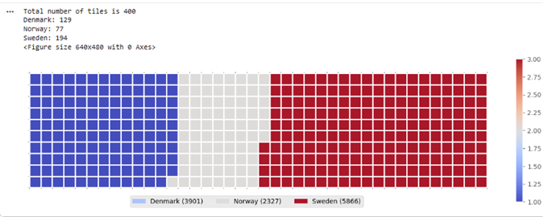
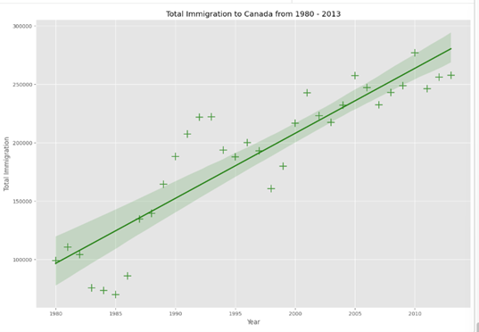
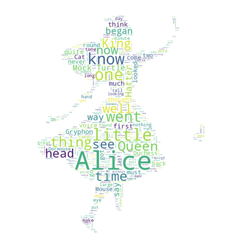
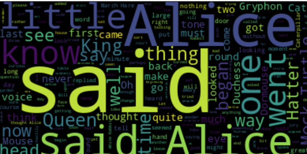

# Waffle Charts, Word Clouds, and Regression Plots

## Project Overview

This project explores advanced data visualization techniques in Python using immigration and text-based datasets. The notebook demonstrates how different visualization methods can be used to communicate patterns, comparisons, and relationships in data.

The project focuses on creating:

- Waffle charts to compare category totals
- Word clouds to visualize frequent words in text
- Masked word clouds using an image shape
- Categorical plots using Seaborn
- Regression plots to analyze relationships between variables

## Project Files

| File | Description |
|---|---|
| `waffle_wordcloud_regression_plots.ipynb` | Main Jupyter Notebook containing the analysis and visualizations |
| `Canada.csv` | Dataset used for immigration data analysis |
| `alice_novel.txt` | Text file used to generate word clouds |
| `alice_mask.png` | Image mask used to create a shaped word cloud |

## Tools and Libraries Used

- Python
- Jupyter Notebook
- Pandas
- NumPy
- Matplotlib
- Seaborn
- PyWaffle
- WordCloud
- Pillow

## Key Visualizations


### 1. Waffle Charts

Waffle charts were used to compare immigration totals across selected countries. This type of visualization is useful for showing proportions and category-based comparisons in a simple visual format.

### 2. Word Clouds

Word clouds were created from text data to highlight the most frequently occurring words. The project also includes a masked word cloud, where the word cloud takes the shape of an image.

### 3. Categorical Plots

Seaborn categorical plots were used to explore and compare grouped data visually.

### 4. Regression Plots

Regression plots were created to examine trends and relationships between variables. These plots help identify whether a positive or negative relationship exists between two numerical fields.

## Skills Demonstrated

- Data visualization with Python
- Creating custom charts
- Working with text data
- Generating word clouds
- Using image masks for visualization
- Creating regression plots with Seaborn
- Data analysis using Pandas
- Presenting insights visually

## How to Run This Project

1. Clone or download this repository.
2. Open the notebook file in Jupyter Notebook, JupyterLab, VS Code, or Google Colab.
3. Make sure the required data files are in the same folder as the notebook:
   - `Canada.csv`
   - `alice_novel.txt`
   - `alice_mask.png`
4. Install the required libraries if needed:

```bash
pip install pandas numpy matplotlib seaborn pywaffle wordcloud pillow
```

5. Run the notebook cells from top to bottom.

## Repository Structure

```text
python-data-visualization-waffle-wordcloud-regression/
│
├── README.md
├── waffle_wordcloud_regression_plots.ipynb
├── Canada.csv
├── alice_novel.txt
└── alice_mask.png
```

## Project Outcome

By completing this project, I practiced creating multiple types of visualizations in Python and learned how to choose different chart types depending on the data and the message being communicated.

This project demonstrates my ability to use Python visualization libraries to create clear, meaningful, and visually engaging data stories.

## Author

**Saeeda Younus**

Data Analyst | Python | Excel | Power BI | SQL
